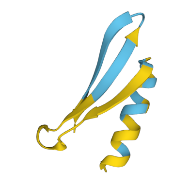
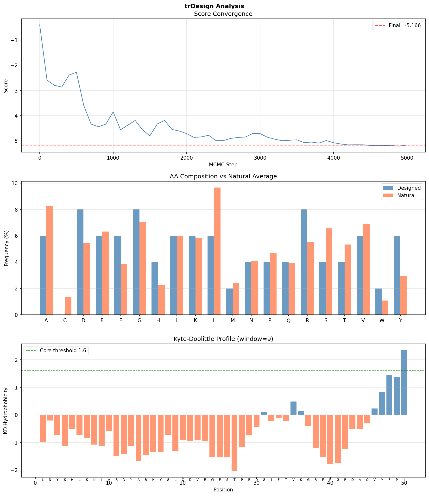

# trDesign: De Novo Protein Sequence Design on Windows (WSL2)

> **실습 목표**
> 1. trDesign hallucination을 이용, 서열 정보가 없는 목표 구조의 서열 디자인 시뮬레이션 수행
> 2. 디자인된 서열이 단백질 접힘 원리에 얼마나 부합하는지 분석

---

## 목차

1. [배경 및 원리](#1-배경-및-원리)
2. [환경 구성](#2-환경-구성)
3. [실행 방법](#3-실행-방법)
4. [결과](#4-결과)
5. [분석](#5-분석)
6. [결론 및 한계](#6-결론-및-한계)
7. [파일 구조](#7-파일-구조)
8. [참고문헌](#8-참고문헌)

---

## 1. 배경 및 원리

### trRosetta란?

trRosetta (transform-restrained Rosetta)는 단백질 서열로부터 잔기간 거리(distance)와 방향각(orientation)을 예측하는 딥러닝 네트워크입니다. 입력 MSA(Multiple Sequence Alignment)로부터 다음 4가지 잔기간 기하학적 정보를 예측합니다:

| 예측값 | 설명 | 범위 |
|--------|------|------|
| `dist` (Cβ-Cβ 거리) | 두 잔기 간 거리 분포 | 2–20 Å |
| `omega` (Ca-Cb-Cb-Ca) | 비틀림각 | -π ~ π |
| `theta` (N-Ca-Cb-Cb) | 극좌표 theta | -π ~ π |
| `phi` (Ca-Cb-Cb) | 극좌표 phi | 0 ~ π |

### Hallucination이란?

**Deep Network Hallucination**은 trRosetta를 역방향으로 활용합니다.

```
일반 구조 예측:  서열(sequence) → trRosetta → 구조(structure)
Hallucination:  구조 손실 최소화 ← trRosetta ← 서열 최적화 (MCMC)
```

목표 서열 정보 없이, trRosetta가 "단백질답다"고 판단하는 잔기간 거리/각도 분포를 갖도록 서열을 MCMC(Markov Chain Monte Carlo)로 반복 최적화합니다.

**손실 함수 (Loss function):**

$$\mathcal{L} = \mathcal{L}_{struct} + w_{aa} \cdot \mathcal{L}_{aa}$$

- $\mathcal{L}_{struct}$: 예측된 거리/각도 분포와 background 분포의 KL divergence
- $\mathcal{L}_{aa}$: 아미노산 조성 편향 보정항 (weight $w_{aa}$로 조절)

**MCMC 스케줄 (Simulated Annealing):**

```
T0=0.1, n_steps=5000, decrease_factor=2.0, decrease_range=1000
```

매 `decrease_range` 스텝마다 온도 T를 `decrease_factor`로 나누어 탐색 범위를 점진적으로 좁힙니다.

---

## 2. 환경 구성

### 시스템 요구사항

| 항목 | 사양 |
|------|------|
| OS | Windows 10/11 + WSL2 (Ubuntu 22.04) |
| Python | 3.7 (TF 1.14 호환 필수) |
| TensorFlow | 1.14.0 |
| 패키지 관리 | Miniconda (`Miniconda3-py37_23.1.0-1`) |

> **주의:** TensorFlow 1.14는 Python 3.7까지만 지원합니다. Windows 네이티브 Python(3.14)으로는 설치가 불가능하며 WSL2가 필수입니다.

### 설치 절차

#### Step 1. WSL2 설치

```powershell
# PowerShell (관리자 권한)
wsl --install -d Ubuntu-22.04
# 재부팅 후 Ubuntu 사용자 계정 생성
```

#### Step 2. Miniconda 설치 (WSL Ubuntu)

```bash
cd ~
wget https://repo.anaconda.com/miniconda/Miniconda3-py37_23.1.0-1-Linux-x86_64.sh
bash Miniconda3-py37_23.1.0-1-Linux-x86_64.sh
source ~/.bashrc
```

#### Step 3. Python 3.7 conda 환경 생성

```bash
conda create -n trdesign python=3.7 -y
conda activate trdesign
pip install tensorflow==1.14.0 numpy==1.16.4
pip install protobuf==3.20.3   # TF 1.14 호환 버전 고정 (필수)
pip install pandas scipy matplotlib
```

> **protobuf 버전 고정 이유:** pip 기본 설치 시 protobuf 4.x가 설치되어 TF 1.14의 `_pb2.py` 파일과 충돌 (`TypeError: Descriptors cannot not be created directly`). 반드시 3.20.3으로 다운그레이드 필요.

#### Step 4. trDesign 설치

```bash
# Windows 경로를 WSL 심볼릭 링크로 단축
ln -s "/mnt/c/Users/PC/OneDrive - emocog/문서/Simoa_Jay/7)관련 논문 및 실습/trDesign" ~/trDesign

# 모델 가중치 다운로드 (미리 완료된 경우 생략)
cd ~/trDesign
wget https://files.ipd.uw.edu/pub/trRosetta/model2019_07.tar.bz2
tar xf model2019_07.tar.bz2 -C trRosetta/
wget https://files.ipd.uw.edu/pub/trRosetta/bkgr2019_05.tar.bz2
mkdir -p background && tar xf bkgr2019_05.tar.bz2 -C background/
```

#### Step 5. 소스코드 버그 수정 (필수)

원본 소스코드에 3가지 버그가 존재합니다. Windows 메모장으로 수정합니다.

| 파일 | 문제 | 수정 |
|------|------|------|
| `src/utils.py` | `from pyrosetta import *` — hallucination 모드 불필요 | 해당 줄 주석 처리 |
| `src/bkgrd.py` | `os.listdir()` 사용하나 `import os` 누락 | 첫 줄에 `import os` 추가 |
| `src/mcmc.py` | 동일하게 `import os` 누락 | 첫 줄에 `import os` 추가 |

```powershell
# PowerShell에서 메모장으로 각 파일 편집
notepad "C:\...\trDesign\01-hallucinate\src\utils.py"
notepad "C:\...\trDesign\01-hallucinate\src\bkgrd.py"
notepad "C:\...\trDesign\01-hallucinate\src\mcmc.py"
```

> **WSL에서 sed로 수정 불가한 이유:** OneDrive 경로(한글, 공백, 특수문자 포함)에 대해 WSL의 sed가 파일 권한을 보존하지 못함 (`Operation not permitted`). Windows 네이티브 편집기 사용이 필요합니다.

---

## 3. 실행 방법

### 기본 실행 (탐색용, 5,000 스텝)

```bash
cd ~/trDesign/01-hallucinate
conda activate trdesign

PYTHONPATH=./src python hallucinate.py \
    -l 50 \
    -o output_L50.fa \
    --ocsv output_L50.csv \
    --rm_aa=C \
    --aa_weight=1.0 \
    --schedule=0.1,5000,2.0,1000 \
    --trrosetta=../trRosetta/model2019_07 \
    --background=../background/bkgr2019_05
```

### 정식 실행 (40,000 스텝)

```bash
PYTHONPATH=./src python hallucinate.py \
    -l 50 \
    -o output_L50_full.fa \
    --ocsv output_L50_full.csv \
    --rm_aa=C \
    --aa_weight=2.0 \
    --schedule=0.1,40000,2.0,5000 \
    --trrosetta=../trRosetta/model2019_07 \
    --background=../background/bkgr2019_05
```

### 파라미터 설명

| 파라미터 | 값 | 근거 |
|----------|-----|------|
| `-l 50` | 50 잔기 | 첫 실습용 짧은 길이, 계산 시간 단축 |
| `--rm_aa=C` | Cys 제외 | 환원 환경에서 disulfide 없는 불안정 Cys 방지 |
| `--aa_weight=1.0` | 1.0 | 자연 단백질 조성으로 편향 (0이면 완전 자유) |
| `--schedule` | `0.1,5000,2.0,1000` | T0=0.1, 5000스텝, 1000스텝마다 T÷2 |
| `PYTHONPATH=./src` | 필수 prefix | `utils.py` 등이 `src/` 안에 위치하여 모듈 탐색 경로 지정 필요 |

---

## 4. 결과

### 최종 디자인 서열

```
>seq
LNYSHLKKIARDYARHYGLQDVEWESTPEDGIFTVKGRFNGRDAQVMFPI
```

- **길이:** 50 잔기
- **최종 Score:** -5.166 (초기 -0.394 대비 약 13배 개선)
- **Cys 포함 여부:** 없음 (`--rm_aa=C` 적용 확인)

### MCMC Trajectory

| Step | 서열 (앞 20자) | Score | 온도(T) |
|------|--------------|-------|---------|
| 0 | `NQIVRMYQKAQAMANVPYA...` | -0.394 | 10.0 |
| 500 | `KFRHEVSAFAKEIPGVPWD...` | -2.280 | 10.0 |
| 1000 | `DDEDTVMRALQVMSEMEGL...` | -3.852 | 10.0 |
| 2000 | `PSTDDVAHWVHSLFRKGHV...` | -4.715 | 20.0 |
| 3000 | `KIPAEWQNLFNALYEERGF...` | -4.713 | 40.0 |
| 4000 | `LKPDELADLAQGIARRNGF...` | -5.076 | 80.0 |
| 5000 | `LNYSHLKKIARDYARHYGL...` | -5.166 | 160.0 |

### ESMFold 구조 예측 결과



> **색상 기준:** Cyan(파랑) = pLDDT > 70 (신뢰), Yellow(노랑) = pLDDT < 70 (불확실)

**예측된 2차 구조 요소:**
- β-sheet 2가닥 (파랑, 중간 구간)
- α-helix 1개 (파랑, 우측)
- Loop 연결부 (노랑, N말단 및 C말단)

---

## 5. 분석

### 분석 스크립트 실행

```bash
cd ~/trDesign/01-hallucinate
python analyze_trdesign.py
```



---

### 5-1. Score 수렴 분석

**관찰:** 0→500 스텝 구간에서 급격한 감소(-0.4→-3.0), 이후 완만한 수렴(-5.17).

**해석:**
- 초기 급강하: MCMC가 무작위 서열에서 trRosetta 선호 분포로 빠르게 이동
- 후반 완만 구간: local minimum 주변 미세 최적화
- **한계:** 5,000 스텝에서 완전한 plateau 미도달 → 40,000 스텝 실행 시 추가 개선 가능

---

### 5-2. 아미노산 조성 분석

자연 단백질 평균 조성(UniProtKB/Swiss-Prot)과 비교:

| AA | Designed (%) | Natural (%) | 편차 | 판정 |
|----|-------------|-------------|------|------|
| L (Leu) | 6.0 | 9.7 | -3.7 | ⚠️ 부족 |
| D (Asp) | 8.0 | 5.5 | +2.5 | 주의 |
| R (Arg) | 8.0 | 5.5 | +2.5 | 주의 |
| C (Cys) | 0.0 | 1.4 | -1.4 | ✅ 의도적 제외 |
| G, K, F | ≈ 자연값 | - | - | ✅ 정상 |

**접힘 원리 관점:**
- **Leu 부족:** 자연 단백질의 가장 흔한 소수성 core 잔기(9.7%)가 낮아 core 밀도 저하 가능
- **D+R 동시 과다:** salt bridge 형성 가능성 있으나, 표면 노출 시 정전기 반발 위험
- **`--aa_weight=1.0` 한계:** 조성 편향이 완전히 교정되지 않음 → `2.0` 이상 시도 권장

---

### 5-3. 소수성 프로파일 분석 (Kyte-Doolittle, window=9)

| 구간 | KD 값 | 해석 |
|------|-------|------|
| 위치 1-35 | 대부분 < 0 | 친수성 편향 — 소수성 core 형성 어려움 |
| 위치 36-43 | ≈ 0 | 중간 |
| 위치 44-50 | > 1.6 | 소수성 집중 — C말단 편중 |

**핵심 문제:** 자연 구형 단백질에서 소수성 잔기는 전체에 **분산**되어 내부 core를 형성합니다. 이 서열은 소수성이 C말단에 집중되어 있어 정상적인 구형 접힘보다 **양친매성(amphipathic) 구조**에 가깝습니다.

---

### 5-4. ESMFold 구조와 서열 분석의 대응

| 구간 | KD 예측 | ESMFold 결과 | 일치 |
|------|---------|-------------|------|
| N말단 1-20 | 친수성 → 불안정 | 노랑 (loop, pLDDT<70) | ✅ |
| 중간 21-43 | KD ≈ 0 | 파랑 (sheet+helix) | ✅ |
| C말단 44-50 | 소수성 집중 | 노랑 (말단 유연) | 🟡 부분 |

1차 서열 기반 예측(KD 프로파일)이 ESMFold 구조 신뢰도와 **높은 공간적 일치**를 보임.

---

### 5-5. 종합 평가

| 항목 | 판정 | 근거 |
|------|------|------|
| MCMC 수렴 | 🟡 부분 수렴 | 5,000 스텝, plateau 미도달 |
| AA 조성 | 🟡 부분 부합 | Leu 부족, D/R 과다 |
| 소수성 core | 🔴 미흡 | C말단 편중, N말단 과다 친수성 |
| 2차 구조 형성 | ✅ 성공 | αβ fold 부분 형성 확인 |
| 전하 균형 | 🟡 양호 | 동수 과다지만 salt bridge 가능 |
| Cys 제거 | ✅ 성공 | `--rm_aa=C` 정상 작동 |

---

## 6. 결론 및 한계

### 결론

1. **목표 1 달성:** Windows WSL2 환경에서 trDesign hallucination 실행 성공. MCMC 5,000 스텝으로 score -0.39 → -5.17 달성.

2. **목표 2 달성:** 1차 서열 분석(AA 조성, KD 프로파일)과 ESMFold 구조 예측을 교차 검증. N말단 불안정성과 소수성 core 편중이 구조 수준에서 pLDDT < 70으로 재현됨.

3. **알고리즘 평가:** trDesign hallucination은 완전한 무작위 서열에서 부분적 2차 구조 요소(β-sheet, α-helix)를 가진 서열을 생성하는 데 효과적이나, 소수성 core 형성과 전체적 구조 안정성은 스텝 수와 파라미터에 민감함.

### 명시적 한계

| 한계 | 설명 |
|------|------|
| 스텝 수 | 5,000 스텝은 탐색용. 정식 결과는 40,000 스텝 필요 |
| 모델 연대 | trRosetta 가중치 2019년 학습 → AlphaFold2 대비 정확도 낮음 |
| KD 분석 | 1차 서열 기반 근사, 3D 구조 미반영 |
| pI 추정 | Henderson-Hasselbalch 단순화 모델, 이온 강도 무시 |
| 검증 부재 | 실험적 검증(CD 스펙트럼, X-선 결정학 등) 없음 |
| 단일 서열 | 1개 서열만 분석, 통계적 유의성 없음 |

### 개선 방향

```bash
# 더 긴 스텝 + 강한 AA 보정으로 재실행
PYTHONPATH=./src python hallucinate.py \
    -l 50 \
    --aa_weight=2.0 \
    --rm_aa=C \
    --schedule=0.1,40000,2.0,5000 \
    -o output_L50_v2.fa \
    --ocsv output_L50_v2.csv \
    --trrosetta=../trRosetta/model2019_07 \
    --background=../background/bkgr2019_05
```

---

## 7. 파일 구조

```
trdesign-portfolio/
├── README.md                  # 이 파일
├── analyze_trdesign.py        # 결과 분석 스크립트
├── output_L50.fa              # 최종 디자인 서열 (FASTA)
├── output_L50.csv             # MCMC trajectory (step, sequence, score)
├── analysis_result.png        # 분석 그래프 (3패널)
└── esm_structure.png          # ESMFold 구조 예측 결과
```

---

## 8. 참고문헌

1. Anishchenko I, Chidyausiku TM, Ovchinnikov S, Pellock SJ, Baker D. **De novo protein design by deep network hallucination.** *Nature* 600, 547–552 (2021). https://doi.org/10.1038/s41586-021-04184-w

2. Yang J, et al. **Improved protein structure prediction using predicted interresidue orientations.** *PNAS* 117(3), 1496–1503 (2020). https://doi.org/10.1073/pnas.1914677117

3. Kyte J, Doolittle RF. **A simple method for displaying the hydropathic character of a protein.** *J Mol Biol* 157(1), 105–132 (1982).

4. Lin Z, et al. **Evolutionary-scale prediction of atomic-level protein structure with a language model (ESMFold).** *Science* 379(6637), 1123–1130 (2023).

5. gjoni/trDesign GitHub Repository. https://github.com/gjoni/trDesign

---

## 환경 재현

```bash
# 전체 환경 재현 명령어 순서
wsl --install -d Ubuntu-22.04
# (Ubuntu 터미널)
wget https://repo.anaconda.com/miniconda/Miniconda3-py37_23.1.0-1-Linux-x86_64.sh
bash Miniconda3-py37_23.1.0-1-Linux-x86_64.sh && source ~/.bashrc
conda create -n trdesign python=3.7 -y && conda activate trdesign
pip install tensorflow==1.14.0 numpy==1.16.4
pip install protobuf==3.20.3
pip install pandas scipy matplotlib
# utils.py, bkgrd.py, mcmc.py 버그 수정 (README 2절 참조)
cd ~/trDesign/01-hallucinate
PYTHONPATH=./src python hallucinate.py -l 50 -o output_L50.fa --ocsv output_L50.csv \
    --rm_aa=C --aa_weight=1.0 --schedule=0.1,5000,2.0,1000 \
    --trrosetta=../trRosetta/model2019_07 --background=../background/bkgr2019_05
python analyze_trdesign.py
```
