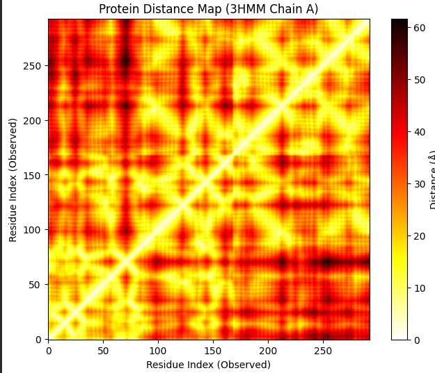
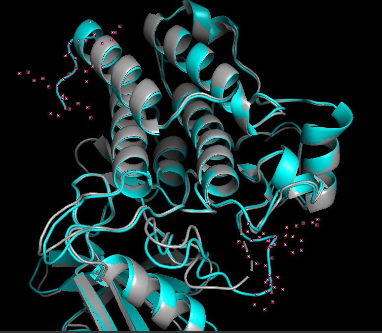
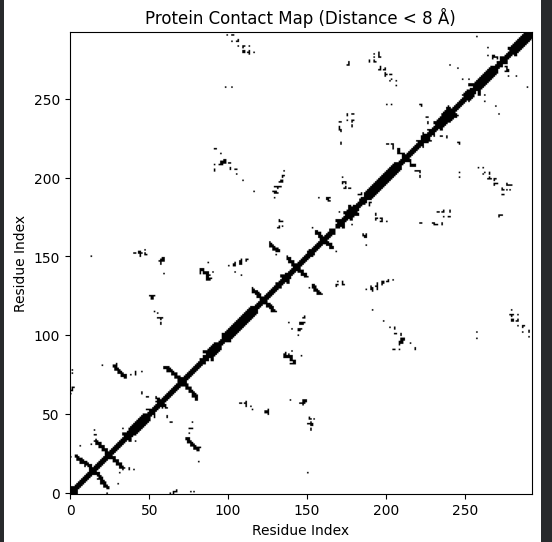

# Protein Data Bank (PDB) 구조 분석 실습

> **LAIDD — 단백질 구조 기반 약물탐색**  
> 강좌: 신약개발을 위한 단백질 구조 예측 및 상호작용 예측 (2강)  
> 실습 환경: Google Colab

---

## 실습 목표

1. PDB 파일에서 단백질 서열(SEQRES) 추출 및 구조 불완전성 분석
2. 단백질(ATOM)과 리간드(HETATM) 분리
3. 3D 좌표 → Distance Map / Contact Map 시각화

---

## 분석 대상

| 항목 | 값 |
|------|-----|
| PDB ID | [3HMM](https://www.rcsb.org/structure/3HMM) |
| 단백질 | TGF-β receptor type 1 (TGFR1) kinase domain |
| 실험 방법 | X-ray crystallography |
| 분석 체인 | Chain A |

---

## 환경 설정

```python
!pip install biopython
!pip install py3Dmol
!pip install biotite
```

| 라이브러리 | 용도 |
|-----------|------|
| `Biopython` | PDB 파싱, 서열 추출, 구조 분리 |
| `NumPy` | CA 좌표 행렬 연산 |
| `SciPy` | 유클리디안 거리 행렬 계산 |
| `Matplotlib` | Distance Map 시각화 |
| `py3Dmol` | Colab 내 인터랙티브 3D 구조 뷰어 |
| `Biotite` | Contact Map 계산 |

---

## 실습 1 — PDB 서열 추출 및 구조 불완전성 분석

### 1-1. SEQRES 서열 추출 (원래 전체 서열)

```python
from Bio import SeqIO

for record in SeqIO.parse(pdb_file, "pdb-seqres"):
    chain_id = record.annotations['chain']
    print(f">Chain {chain_id} (길이: {len(record.seq)} aa)")
    print(record.seq)
```

### 1-2. ATOM 기반 서열 추출 (실제 관측된 서열)

```python
from Bio.PDB import PDBParser
from Bio.PDB.Polypeptide import PPBuilder

parser = PDBParser(QUIET=True)
structure = parser.get_structure('protein', pdb_file)
ppb = PPBuilder()

for idx, pp in enumerate(ppb.build_peptides(structure)):
    print(f">Fragment {idx+1} (길이: {len(pp.get_sequence())} aa)")
    print(pp.get_sequence())
```

### 분석 결과 (3HMM Chain A)

| 항목 | 값 | 해석 |
|------|-----|------|
| SEQRES 전체 서열 길이 | 303 aa | 실험에 사용된 원래 단백질 |
| ATOM 관측 서열 | 293 aa (Fragment 2개) | 3D 좌표가 실제로 존재하는 잔기 |
| 누락 잔기 수 | 10 aa | X선에 좌표가 찍히지 않은 유연한 구간 |
| 루프 영역 누락 | 5 aa (`PNHRV`) | Fragment 1-2 사이 연결 루프 |
| C-말단 꼬리 누락 | 5 aa (`EGIKM`) | C-말단 자유 말단부 |

- **말단 꼬리 (N/C-말단):** 한쪽 끝이 허공을 향해 열려 있어 구조적 제약 없이 자유롭게 움직임 → X선 회절 시 전자 밀도 불명확
- **루프 영역:** α-helix 및 β-sheet를 연결하는 유연한 관절 구조로, 표적 결합 시 형태 변화(Induced fit)가 필수적이어서 본질적으로 유동적

> **한계:** 누락 잔기 탐색은 문자열 정합(string matching)에 의존하므로, 서열 반복(repeat) 구간에서 오매핑 가능성 존재.

---

## 실습 2 — 단백질 / 리간드 분리

```python
from Bio.PDB import Select, PDBIO

class ProteinSelect(Select):
    def accept_residue(self, residue):
        return residue.id[0] == ' '           # ' ' = 표준 아미노산 (ATOM)

class LigandSelect(Select):
    def accept_residue(self, residue):
        return residue.id[0].startswith('H_') # 'H_' = 헤테로 원자 리간드
                                               # 'W'  = 물 분자 → 자동 제외
```

| `residue.id[0]` | 의미 |
|-----------------|------|
| `' '` (공백) | 표준 아미노산 (ATOM) |
| `'H_XXX'` | 헤테로 원자 리간드 (HETATM) |
| `'W'` | 물 분자 (HOH) |

---

## 실습 3 — 3D 좌표 → Distance Map / Contact Map

### 3-1. Distance Map

```python
from scipy.spatial import distance_matrix

ca_coords = [residue['CA'].get_coord()
             for residue in structure[0]['A']
             if residue.id[0] == ' ' and 'CA' in residue]

coords_array = np.array(ca_coords)
dist_matrix = distance_matrix(coords_array, coords_array)

plt.imshow(dist_matrix, cmap='hot_r', origin='lower')
plt.colorbar(label='Distance (Å)')
```



| 패턴 | 해석 |
|------|------|
| 대각선 (흰색, 0Å) | 자기 자신과의 거리 |
| 대각선 근방 밝은 덩어리 | 국소적으로 조밀한 구조적 도메인 경계 |
| 원거리 밝은 점 | 서열상 멀지만 3D 공간에서 인접 → 3차 접힘 정보 |

> **알고리즘 한계:** `scipy.distance_matrix`는 O(N²) 메모리를 요구합니다. N > 1,000 잔기에서 병목 발생 가능.

---

### 3-2. 인터랙티브 3D 구조 뷰어 (py3Dmol)

```python
import py3Dmol

with open("3HMM_protein.pdb") as f:
    pdb_data = f.read()

view = py3Dmol.view(width=800, height=500)
view.addModel(pdb_data, 'pdb')
view.setStyle({'model': -1}, {'cartoon': {'color': 'spectrum'}})
view.zoomTo()
view.show()
```



| 색상 | 해석 |
|------|------|
| Cyan (청록색) | 높은 신뢰도의 구조 영역 (α-helix, β-sheet) |
| Gray (회색) | 중첩 비교 구조 — 루프 영역에서 편차 발생 |
| 분홍색 점 | 결합된 리간드 또는 소분자 원자 |

---

### 3-3. Contact Map (8Å 기준 이진 접촉 지도)

```python
import biotite.structure as struc

ca_atoms = protein[protein.atom_name == "CA"]
cell_list = struc.CellList(ca_atoms, cell_size=8.0)
contact_matrix = cell_list.create_adjacency_matrix(8.0)

plt.imshow(contact_matrix, cmap='Greys', origin='lower')
```



| 패턴 | 해석 |
|------|------|
| 대각선 굵은 선 | 인접 잔기 간 기본 접촉 |
| 대각선 근방 X자 패턴 | α-helix의 나선형 접촉 패턴 |
| 대각선 바깥 산발적 점 | 3차 접힘으로 인한 원거리 접촉 → 활성 포켓 후보 |

---

## Distance Map vs Contact Map 비교

| 항목 | Distance Map | Contact Map |
|------|-------------|-------------|
| 출력값 | 연속적 거리 (Å) | 이진값 (0/1) |
| 임계값 | 없음 | 8Å (표준) |
| 계산 | `scipy` O(N²) | `CellList` 공간 분할 (효율적) |
| 활용 | 구조 전체 조망, 도메인 경계 | 2차/3차 구조 패턴, 활성 포켓 탐색 |

---

## 실습 결과 요약

| 분석 항목 | 주요 발견 | 신약개발 관련성 |
|-----------|-----------|----------------|
| 서열 불완전성 | 303→293 aa, 10 aa 누락 | 누락 루프가 결합 포켓일 가능성 |
| 단백질/리간드 분리 | ATOM/HETATM 기준 분리 성공 | 도킹 시뮬레이션 입력 준비 |
| Distance Map | 도메인 경계 및 거리 분포 시각화 | 구조적 도메인 단위 약물 타겟 탐색 |
| Contact Map | α-helix/β-sheet 패턴, 원거리 접촉 | 활성 포켓 후보 잔기 쌍 식별 |

---

## 명시적 한계

| 한계 | 설명 |
|------|------|
| 단일 구조 분석 | 동적 거동 미반영 |
| 정적 스냅샷 | X선 결정 구조는 결정 환경의 정적 상태 → 생리적 조건과 차이 가능 |
| 누락 잔기 미모델링 | 루프 영역은 homology modeling 또는 MD로 보완 필요 |
| CA 원자 기준 | 실제 원자 수준 상호작용의 근사값 |

---

## 파일 구조

```
pdb_analysis/
├── README.md
├── pdb_prac1.py
└── images/
    ├── distance_map.png
    ├── contact_map.png
    └── structure_3hmm.png
```

---

## 참고문헌

1. Berman HM, et al. **The Protein Data Bank.** *Nucleic Acids Res.* 28(1), 235–242 (2000).
2. Cock PJ, et al. **Biopython.** *Bioinformatics* 25(11), 1422–1423 (2009).

---

## 관련 링크

| 리소스 | URL |
|--------|-----|
| 3HMM 구조 (RCSB PDB) | https://www.rcsb.org/structure/3HMM |
| Biopython 문서 | https://biopython.org/wiki/Documentation |
| py3Dmol | https://github.com/3dmol/3Dmol.js |
| Biotite | https://www.biotite-python.org |
